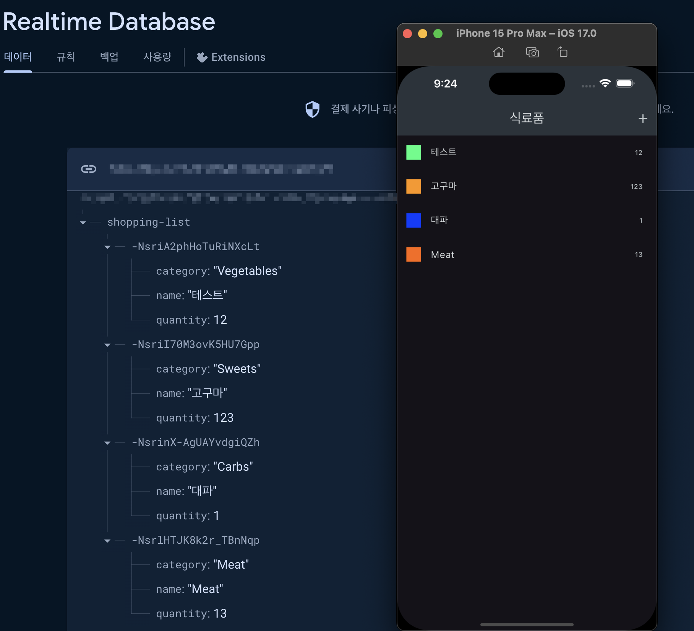

# 쇼핑 리스트 앱

강의가 막바지에 이르니.. 드디어 실무에서 써볼만한 기능들이 하나 둘 씩 나오는 것 같습니다.

기본적으로 항목을 추가하고 제거 하는 기존 강의에 Firebase를 이용하여 외부에서 데이터를 관리하는 앱을 만들 수 있습니다.

[firebase](https://firebase.google.com/?hl=ko)에서 로그인 후 프로젝트 생성 후
데모 프로젝트로 Realtime Database를 만든 후 url을 해당 코드에서 `assets/config/.env`의 key 값만 변경 시 테스트 할 수 있습니다.

정상적으로 동작하면 아래와 같이 항목을 추가 제거 할 수 있습니다.

이번 강의에서는 Future를 사용하여 snapshot을 이용해 코드를 더욱 직관적으로 만들 수 있던 점이 아닐까 생각합니다.
