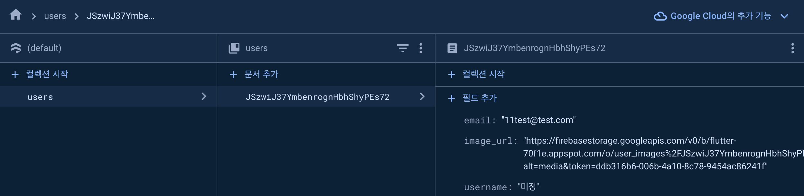

# chat_app

A new Flutter project.

## Getting Started

[공식 문서](https://firebase.google.com/docs/flutter/setup?hl=ko&platform=ios)를 참조하여 firebase 설정을 할 수 있습니다.

firebase에 로그인 상태에서 아래의 명령어를 입력하면 flutter firebase 설정을 할 수 있다.

``` flutter
flutterfire configure
``


firebase 설정과 관련하여 아래와 같이 파일을 추가해야 한다.

firebase.json
**/android/app/google-services.json
**/ios/Runner/GoogleService-info.plist
**/lib/firebase_options.dart
**/macos/Runner/GoogleService-info.plist
