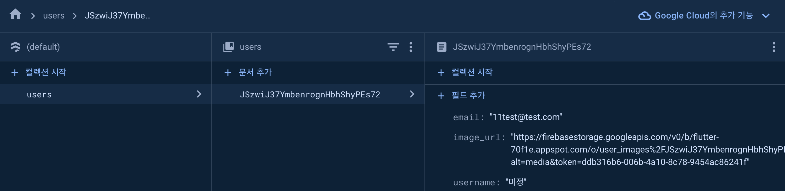

# Udemy To Flutter

Udemy에서 유료 강의([링크](https://www.udemy.com/course/learn-flutter-dart-to-build-ios-android-apps/))를 학습하며, 필요한 내용을 정리한 저장소입니다.

기존 [소스 코드](https://github.com/academind/flutter-complete-guide-course-resources)를 참고하며 학습한 내용을 정리했습니다.

---

- [Udemy To Flutter](#udemy-to-flutter)
  - [01. Roll Dice App](#01-roll-dice-app)
  - [02. Quiz App](#02-quiz-app)
  - [03. Calculate App](#03-calculate-app)
  - [04. Checkbox Radio App](#04-checkbox-radio-app)
  - [05. Food Recipe App](#05-food-recipe-app)
    - [Riverpod](#riverpod)
  - [06. Shopping List App](#06-shopping-list-app)
  - [07. Place Save App](#07-place-save-app)
  - [08. Chatting App](#08-chatting-app)

---

## 01. Roll Dice App

이미지를 여러개 넣어 놓고 랜덤으로 화면을 전환하는 앱입니다.

구조가 간단하고 기본적인 플러터의 기능에 대해 학습할 수 있는 앱이라고 생각합니다.

## 02. Quiz App

퀴즈 항목 샘플 데이터를 넣고 해당 값이 정답 유무를 확인하는 앱입니다.

위의 앱과 내장 DB 또는 API를 활용하여 다양한 방법으로 활용할 수 있을 것으로 생각됩니다.

## 03. Calculate App

해당 앱은 가게부라기보다는 계산 또는 뭐.. 그런저런 기능을 체험하는 앱이라 생각합니다.

## 04. Checkbox Radio App

기본적인 라디오 버튼과 체크박스 사용 방법에 대해 학습할 수 있습니다.

## 05. Food Recipe App

Riverpod에 대한 고민도 필요하고.. 순간 진입 장벽이 느껴졌습니다.

전역 변수를 쉽게 관리하기 위한 방법인 것 같은데 이게 많이 쓰이는지는 모르겠지만 우선 좀 어렵네요.

onWillPop 해당 기능이 deprecated 됐으며, PopScope 변경('WillPopScope' is deprecated and shouldn't be used. Use
PopScope instead. This feature was deprecated after v3.12.0-1.0.pre)이 됐습니다.

```dart
Widget build(BuildContext context) {
  return Scaffold(
    body: WillPopScope(
      onWillPop: () async {
        Navigator.of(context).pop({
          Filter.glutenFree: _glutenFreeFilterSet,
          Filter.lactoseFree: _lactoseFreeFilterSet,
          Filter.vegetarian: _vegetarianFilterSet,
          Filter.vegan: _veganFilterSet,
        });
        return false;
      },
      child: Column(
        children: [
        ],
      ),
    ),
  );
}
```

기존 코드를 위와 같은 형태 였다면 지금은 아래와 같이 해줘야 합니다.

```dart
Widget build(BuildContext context) {
  return Scaffold(
    body: PopScope(
      canPop: false,
      onPopInvoked: (didPop) async {
        if (didPop) {
          return;
        }
        Navigator.of(context).pop({
          Filter.glutenFree: _glutenFreeFilterSet,
          Filter.lactoseFree: _lactoseFreeFilterSet,
          Filter.vegetarian: _vegetarianFilterSet,
          Filter.vegan: _veganFilterSet,
        });
      },
      child: Column(
        children: [
        ],
      ),
    ),
  );
}
```

위의 설정은 최근 flutter를 업데이트 하면서 발생한 이슈로 판단됩니다. 3.10을 쓰다가 3.20 올리면서 발생한 이슈라고 생각되네요.

이와 관련된 이슈로 3.16 이전 버전의 Flutter는 Gradle의 선언적 플러그인 {} 블록을 쓰기 때문에 변경([문서 링크](https://docs.flutter.dev/release/breaking-changes/flutter-gradle-plugin-apply)) 해야 합니다.

학습 중 안드로이드 폰이 어느 순간 배포가 안돼서 삽질을 조금 했는데 문제의 원인은 C Type 케이블 불량이었습니다.

계속 배포가 안돼서 apk를 만들어서 직접 올려보려다가 폰으로 업로드가 중간에 안돼서 혹시나 바꿔보니 잘 되던... 혹시나 안되면 케이블 문제일 수 있습니다.

### Riverpod

상태 관리를 위해 하나의 상태를 모든 화면에서 끌고 들어가는 부분이 있는데 Reverpod를 쓰면 이러한 상태 관리를 조금 더 쉽게 할 수 있는 것 같습니다.
[공식 문서](https://riverpod.dev/)를 읽어보면 좋을 거 같다 생각합니다.

## 06. Shopping List App

드디어 Frontend와 Backend가 분리된 예제를 학습했습니다.

기본적으로 항목을 추가하고 제거 하는 기존 강의에 Firebase를 이용하여 외부에서 데이터를 관리하는 앱을 만들 수 있습니다.

[firebase](https://firebase.google.com/?hl=ko)에서 로그인 후 프로젝트 생성 후
데모 프로젝트로 Realtime Database를 만든 후 url을 해당 코드에서 `assets/config/.env`의 key 값만 변경 시 테스트 할 수 있습니다.

정상적으로 동작하면 아래와 같이 항목을 추가 제거 할 수 있습니다.

<div align="center">
  
</div>

이번 강의에서는 Future를 사용하여 snapshot을 이용해 코드를 더욱 직관적으로 만들 수 있던 점이 아닐까 생각합니다.

## 07. Place Save App

개인적인 생각으로 이 정도까지만 배우면 Flutter를 이용해서 간단한 App은 만들 수 있을 것이라 생각됩니다.

해당 강의에서는 내부 DB(sqllite)를 이용해 DB의 정보를 저장하고 로드 시 불러오는 기능을 구현했습니다.

실제로 구글 지도의 API를 지정하기 위해 각각의 `android` `ios` 폴더에 key 값을 저장(따로 confing로 분리)해서 해보니
 나름 재밋었던 것 같네요.

## 08. Chatting App

Firebase 설정은 [공식 문서](https://firebase.google.com/docs/flutter/setup?hl=ko&platform=ios)를 참조하여 firebase 설정을 할 수 있습니다.

Firebase에 로그인 상태에서 아래의 명령어를 입력하면 flutter firebase 설정을 할 수 있습니다.

``` flutter
flutterfire configure
```

<div align="center">
  
</div>

위와 같이 회원가입을 하면 Firebase에 저장되고 실제 데이터를 읽어와서 로그인 할 수 있습니다.

chat 컬렉션안에는 여러 키리스트가 있고 그 값들을 이용해서 채팅 리스트 항목을 만드는 것 같습니다.

<div align="center">
  
</div>

그렇지만 위의 예제처럼 채팅 컬렉션에 다 넣으면 나중에 성능 이슈가 나올 것 같다고 생각되지만(아닐 수도..?), 예제를 통해
 Flutter를 알기 쉽게 설명해주는 예제라 생각됩니다.
